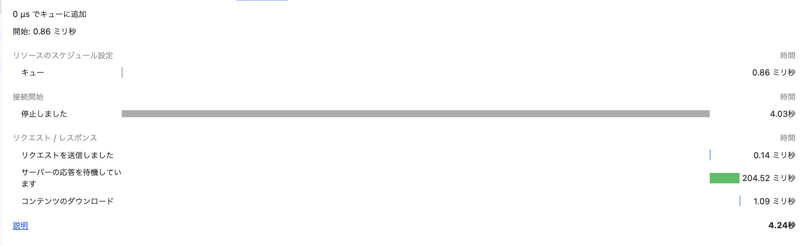
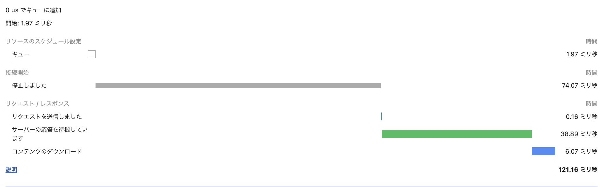

## 課題1
A.
CDNは世界中の複数のサーバー（エッジサーバー）にコンテンツをキャッシュすることで、ユーザーに最も近いサーバーからコンテンツを配信できる。これにより、レイテンシーが大幅に削減される。
また、オリジンサーバーへの直接的なアクセスが減少し、複数のCDNサーバーにトラフィックが分散されるため、オリジンサーバーの負荷が軽減される。
同じコンテンツに対する複数のリクエストをCDNが処理することで、オリジンサーバーの帯域幅使用量も削減される。
さらに、CDNは最適化されたルーティングとキャッシュ技術を使用してコンテンツを高速に配信するため、ページロード時間が短縮され、ユーザーエクスペリエンスが向上する。

A.
オリジンサーバはコンテンツの元となるサーバであり、エッジサーバはそのコンテンツをキャッシュしてユーザーに提供するサーバである。エッジサーバは地理的にユーザーに近い場所に配置されるため、アクセス速度が向上する。

A.
ブラウザキャッシュはユーザーのデバイスに依存するため、異なるデバイスやブラウザを使用する場合には効果がない。
一方、CDNはエッジサーバにコンテンツをキャッシュするため、どのデバイスやブラウザからアクセスしても高速にコンテンツを提供できる。
また、CDNはグローバルに分散しているため、地理的に離れたユーザーにも高速にコンテンツを配信できる。

## 課題2

A.
次のURLでS3にアップロードした画像にアクセスできることを確認した。
https://praha-kou-s3.s3.us-east-2.amazonaws.com/icon.png

A.
次のURLでCloudFrontを経由して画像にアクセスできることを確認した。
https://d2np48ovrfrcxj.cloudfront.net/icon.png

A.
S3から画像を取得した場合は、リージョンによって所要時間が異なるが、CloudFront経由で画像を取得した場合は、キャッシュされたコンテンツが提供されるため、リクエスト/レスポンスの所要時間が短縮される。
S3経由で画像を取得した場合は4.24秒かかったが、CloudFront経由では121.16ミリ秒と大幅に短縮された。

