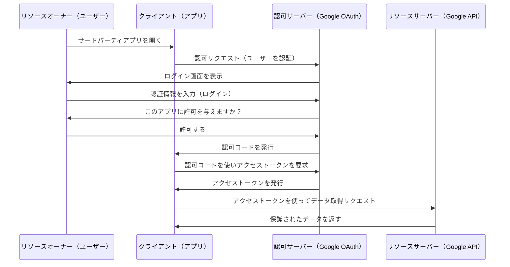
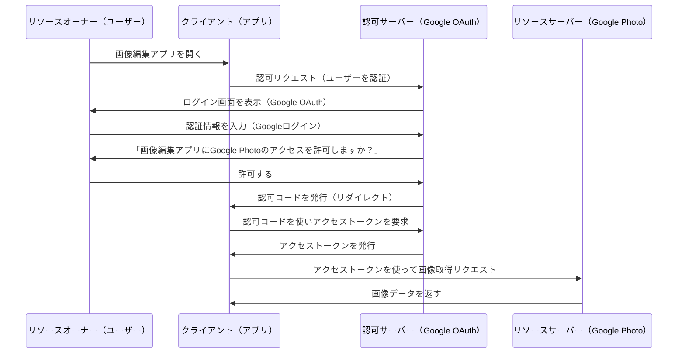
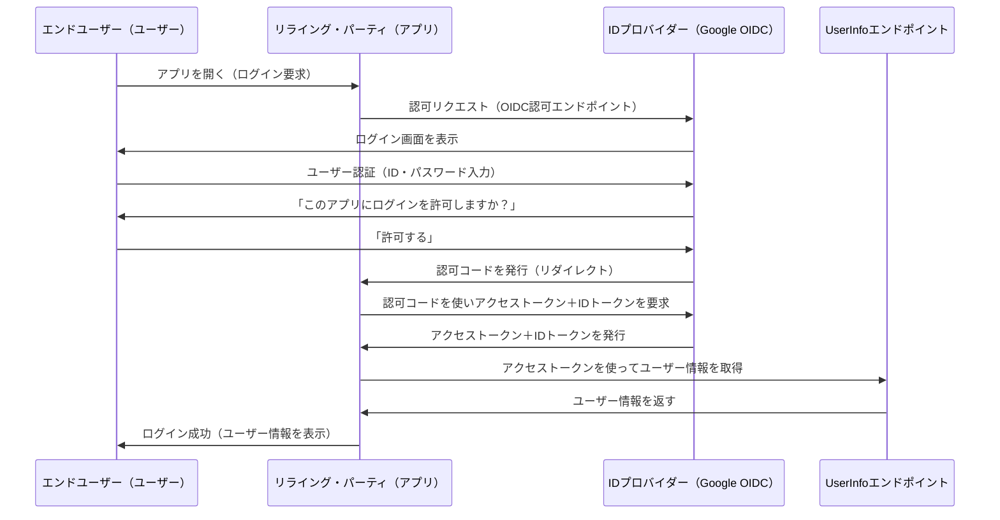

# 課題1

## 解答1
認証（Authentication） は、「誰であるかを確認すること」である。
- 例: 図書館の入り口で学生証を提示して、生徒であることを証明する。
- システムでは、ID・パスワードや指紋認証などで「本人確認」を行う。

認可（Authorization） は、「何をできるかを決めること」である。
- 例: 生徒は本を借りられるが、教員専用のエリアには入れない。
- システムでは、管理者だけが設定を変更できる、といった権限の制御が行われる。
  - 例) RBAC、PBAC

## 解答2
Auth2.0は「認証」ではなく「認可」の仕組み
- 本来は「アプリがユーザーのデータにアクセスする許可を得る」ためのプロトコル
- そのままでは「この人が誰か」を保証できない

## 解答3
- リソースオーナー（Resource Owner）
  - 保護されたリソース（データ）の持ち主（通常はユーザー）。
  - 例: Googleアカウントのユーザー。
- クライアント（Client）
  - ユーザーのデータにアクセスしたいアプリやサービス。
  - 例: ユーザーのGoogleカレンダーにアクセスしたいサードパーティアプリ。
- 認可サーバー（Authorization Server）
  - リソースオーナーの許可を得て、アクセストークンを発行するサーバー。
  - 例: GoogleのOAuth2.0 認可サーバー。
- リソースサーバー（Resource Server）
  - アクセストークンを確認し、適切なデータを提供するサーバー。
  - 例: GoogleのカレンダーAPI。



## 解答4
認可コードグラントは、クライアント（アプリ）がリソースオーナー（ユーザー）に代わってリソースサーバーのデータにアクセスできるようになるまでの流れを定めたものである。



## 解答5
- アクセストークン
  - APIにアクセスするための「鍵」。一定時間で期限切れになる。
  - 例 ) 遊園地に行くときに「入場チケット」
- リフレッシュトークン
  - 新しいアクセストークンを発行するための「更新用トークン」。
  - 例 ) 遊園地の「年間パス」
- 認可コード
  - アクセストークンと引き換えるための「一時的なコード」。
  - 例 ) コンサートのチケットを買うとき、最初に「購入確認メール」
- 認可エンドポイント
  - ユーザーがログインして許可を与えるページのURL。
- トークンエンドポイント
  - 認可コードをアクセストークンに交換するためのURL。
- リダイレクトエンドポイント
  - 認可サーバーが認可コードをクライアントに渡すためのURL。

## 解答6
OIDC（OpenID Connect）は、OAuth2.0をベースにした 「認証」 のための拡張仕様である。

OAuth2.0が「認可（Authorization）」に特化しているのに対し、OIDCは「認証（Authentication）」を加えている。

これにより、クライアント（リライング・パーティ）が 「ユーザーが誰なのか？」 を知ることができる。

OIDCでは 「IDトークン（ID Token）」 を発行することで、ユーザーの認証情報を取得できる。



## 解答7
IDトークンは「この人が誰か？」を証明するトークンであり、OIDCの核となる仕組みである。

JWT（JSON Web Token）というフォーマットで構成されている。

次の3つの部分に分かれている。

1. ヘッダー（Header）- 署名アルゴリズムなど
2. ペイロード（Payload）- ユーザー情報
3. 署名（Signature）- 改ざん検知のためのデジタル署名

```json
{
  "iss": "https://accounts.google.com",
  "sub": "1234567890",
  "aud": "my-client-id",
  "exp": 1610235945,
  "iat": 1610232345,
  "email": "user@example.com",
  "name": "John Doe",
  "picture": "https://example.com/photo.jpg"
}
```

アクセストークンは「APIアクセス権限を管理」するためのもので、IDトークンとは目的が異なる。

UserInfoエンドポイントは「IDトークンに含まれない追加のユーザー情報を取得するためのAPI」である。

OIDCを使えば、OAuth2.0の「認可」だけでなく、「認証」も安全にできる。

# 課題2

## 解答1
Clerkを使った認証の実装。

https://github.com/kou-tech/praha-frontend/tree/feature/clerk

## 解答2
NextAuth.jsを使った認証の実装。

https://github.com/kou-tech/praha-frontend/tree/feature/next-auth
