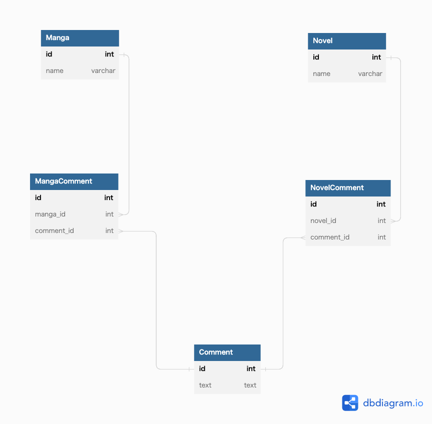

# 課題1

- 外部キーを利用することができない。
 → レコードが存在しない主キーでも設定することができるため、参照を保証することができない。

## 課題2

## 課題3
- アパレル系のECサイトを開発していると仮定する。
  - 商品種別ごとのテーブルを作成する。
  - product_hat (帽子商品)
  - product_clothes (服商品)
  - product_shoes (靴商品)
  - 注文明細テーブルにproduct_idカラムと商品種別カラムが美うまれてアンチパターンに陥る。