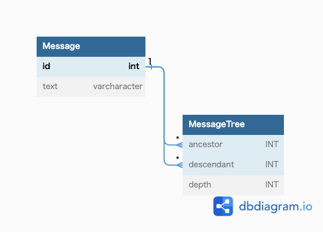

## 課題1
- ツリー構造での取得が厳しい
  - 階層構造がレコードによって変動するため、結合回数が把握できないため
- レコード削除する場合、外部キー制約で子レコードから削除や親レコードの更新を行う必要があり、扱いづらい
- 特定階層のみの取得が厳しい
  - 3階層まで初期表示したい要望があった際に、対応ができない。理由は結合回数が把握できないため

## 課題2
閉法テーブルで構成する。

## 課題3
- アパレル系のECサイトを開発する場合
  - Tシャツ、シャツ、パーカーなどとカテゴリーしていたが、仕様変更で上位カテゴリーとしてトップスが発生し、雑貨を取り扱うようになったためさらに上位カテゴリーに服が発生した。
  - その際にカテゴリーテーブルに対して、parent_category_idとして、上位のカテゴリーの配下としておりアンチパターンに陥った。

