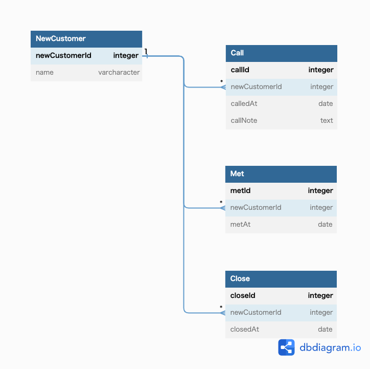

# 課題1
## 回答
- 商談が複数回発生してくると、それに合わせて商談内容を記録するカラムを増やさなければならない。
- 1度の商談で電話、面談、成約が複数回発生してくると、最大数に合わせてカラムを追加しなければならないし、最大数の予測も厳しい。
- イージーな設計をしているので、一度再成約した場合は成約カラムを更新し直す必要があり、過去に解約したというデータが失われる。

# 課題2

## 説明
- 各イベントごとにテーブルを設計。
- ~したらTrueになるは、対象のイベントのレコードが存在している時点で条件を満たすと判断したため削除。
- パフォーマンスを意識すると、NewCustomerに電話回数、面談回数、成約回数、解約回数を持たせておくと、DBアクセス判定できそう。

# 課題3
在庫管理システムを開発しているとする。
- 商品のマスタテーブルに対して、入荷日時、 発送日時というカラムを設けていたため、再入荷された場合に対応できなく、アンチパターンに陥った。