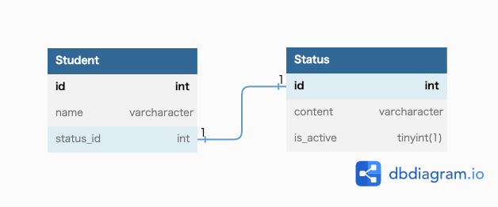

# 課題1
サーティーワンフレーバー

## 回答
- レコードを扱う側が、statusにどのようなデータが入るか想像しづらい。
  - 例) 全てのレコードが卒業の場合、他のstatusが何があるか把握が厳しい。
- statusを追加、削除する場合、Check制約を貼り直す必要がある。
- 停学中 -> 在学中 -> 卒業となった場合、その人が停学していたという事実がわからなくなる。
- Check制約がないDBに移行される場合、整合性を担保できない可能性がある。

# 課題2

# 課題3
- 商品管理システムと想定
  - 商品の状態に、[キャンセル,受注中、生産中、発送]とあり、statusカラムで管理している。