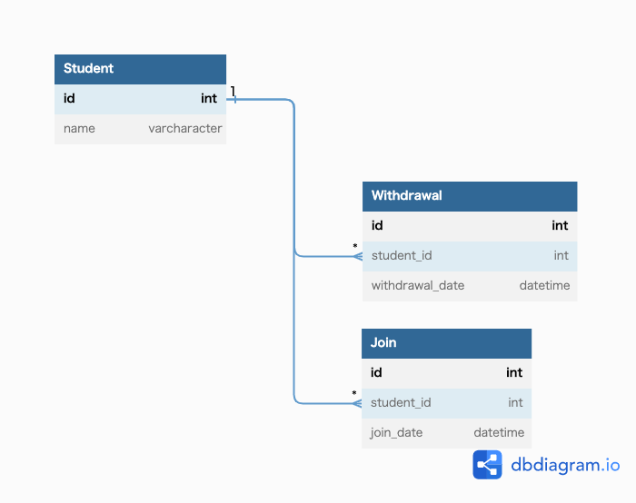
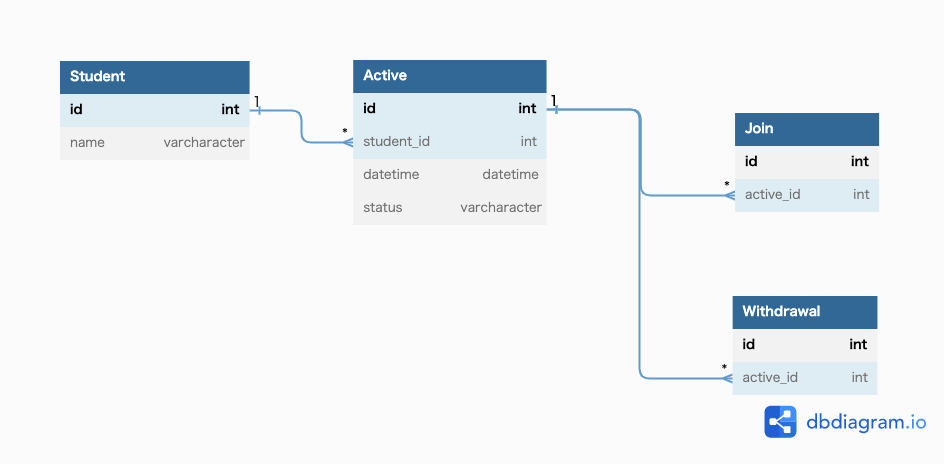

# 課題1
## 回答
論理削除

- 退会していないStudentを参照する場合、毎回条件に`taikaiFlg = false`を指定する必要がある。
- 退会取り消しなどができた場合、バグを生みやすくなる.
  - 退会時にStudentに関連しているレコードも同様に削除している場合、復活させなければいけないなど
- ユースケースによるが、Studentというリソースに退会イベントが紛れている。

# 課題2
## 回答
### イベントを切り出した設計

### 有効な状態を取得するのに大変になる問題の解決案

# 課題3
## 1
- 複数注文していて、誤った注文の方をキャンセルしてしまったのでキャンセルを取り消してほしい。
- 運用する上で上長から、注文をキャンセルする人の割合を出してほしいと言われた。

## 2
- これまでの退会者を把握することができない。
- 退会後に入会した場合の条件の抽出ができない。

## 3
私の開発現場では論理削除が基本だったので、あまり物理削除を採用するケースはありませんでした。
また、物理削除を採用するケースはPMに相談して業務知識に影響しない範囲に限定していました。

