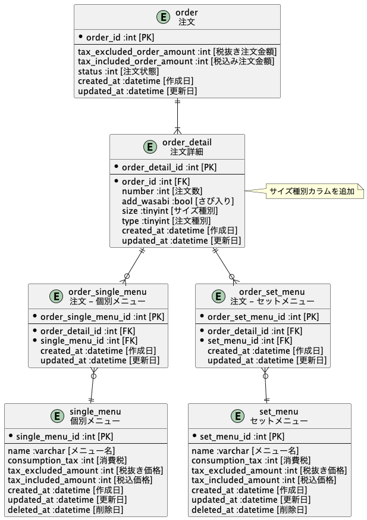
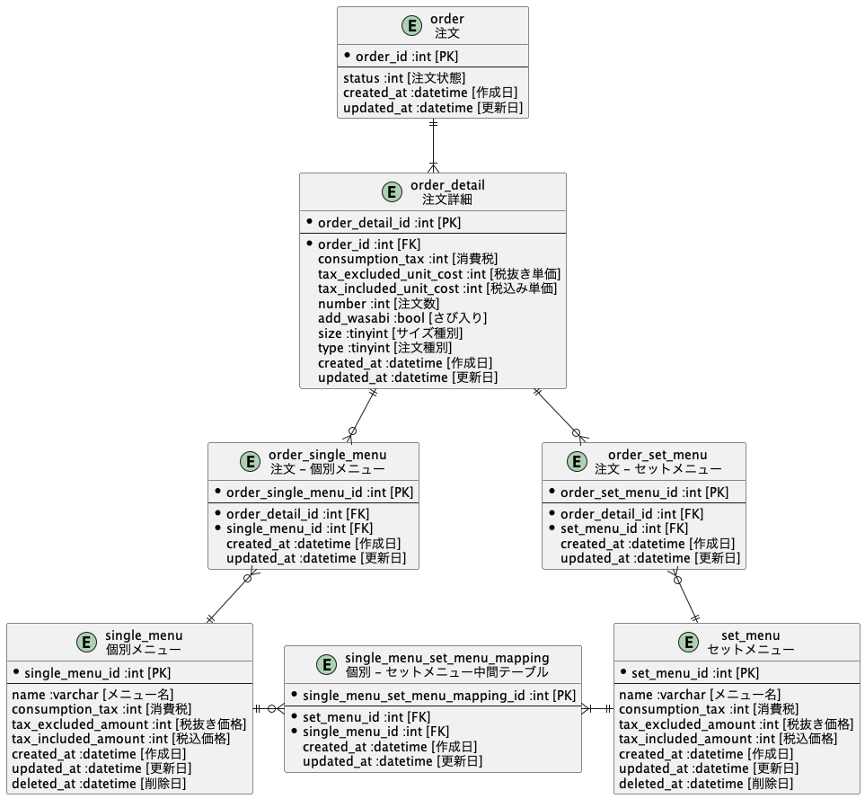

# 課題1
## 回答

# 課題2
## 回答

- 注文詳細テーブルにサイズ種別カラムを用意する。

Ex) 1: 小, 2: 中, 3: 大

## 回答

- 個別メニューとセットメニューの中間テーブルを作成する。

# 課題3
## 回答
- お好み寿司で「握り寿司」「軍艦、巻き寿司」「サイドメニュー」でカテゴリーを区別する必要がありました。(ネタのカテゴリーを分類基準は深く考慮する必要がないです。)

## 回答

