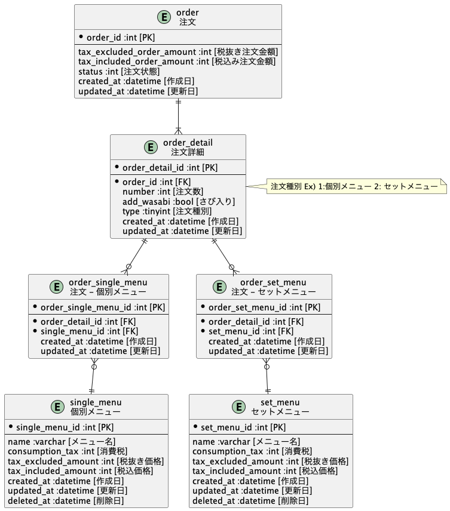
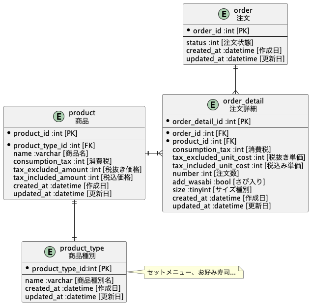
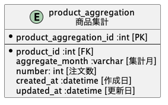

# 課題1
## 回答

- 注文詳細テーブルで商品テーブルとは別で消費税、税抜き単価、税込み単価を用意する。
  - 商品の価格変更でレコードの価格フィールドが更新されると、過去注文情報の金額と差異が生じるため
- セットメニューとお好み寿司との区別は商品種別のマスタテーブルを作成する。

# 課題2
## 回答

- 注文詳細テーブルにサイズ種別カラムを用意する。

Ex) 1: 小, 2: 中, 3: 大

## 回答

- 集計月フィールドを用意して、商品ごとで合計注文数を集計する。

# 課題3
## 回答
- お好み寿司で「握り寿司」「軍艦、巻き寿司」「サイドメニュー」でカテゴリーを区別する必要がありました。(ネタのカテゴリーを分類基準は深く考慮する必要がないです。)

## 回答

