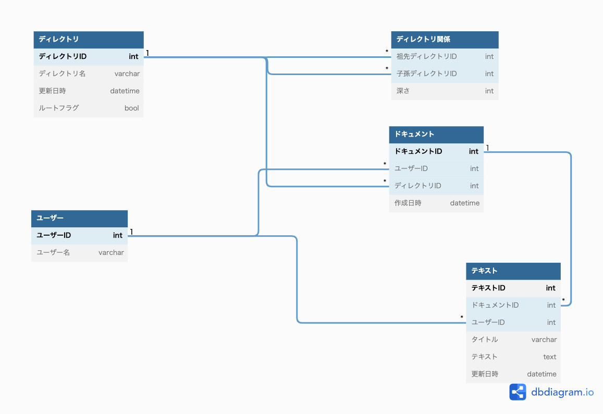
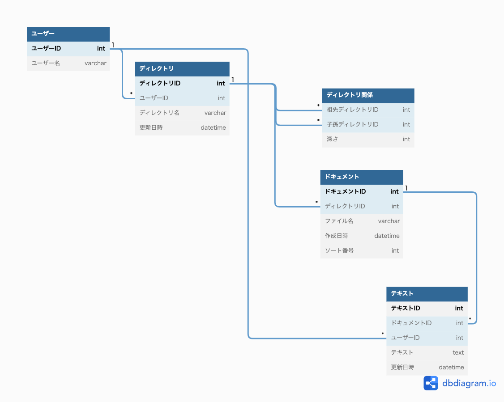

# 課題1
## 回答

- ディレクトリ、ドキュメントの削除は物理削除で行う。
  - 戻す機能があるのであれば、状態カラムに`削除予定`として一定時間後の削除にするかも。
- テキストは別テーブルで管理することで、更新毎にレコードを追加していき、ロールバックに対応している。(バージョンニング対応)
- ディレクトリの更新はカラム更新で行う。

# 課題2
## 回答

- ドキュメントテーブルにソート番号を持たせる。ディレクトリIDとソート番号で複合ユニーク制約をかければ、重複されない条件は担保できると考える。

## trello
- PUT送信 (APIへではない？)
  - pos: ?
  - token: ?

- POST送信
  - batch データのまとまり？
  - metadata
  - sentAt 送信日時？