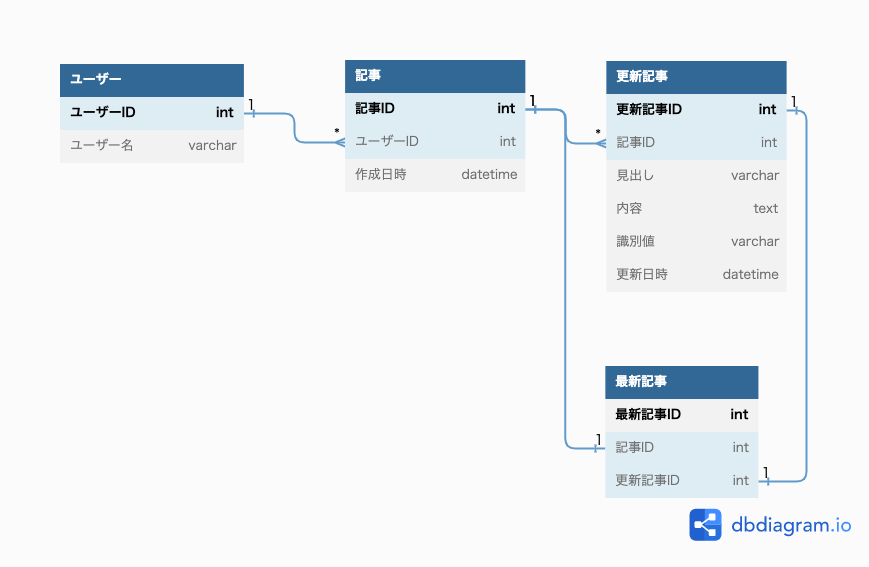
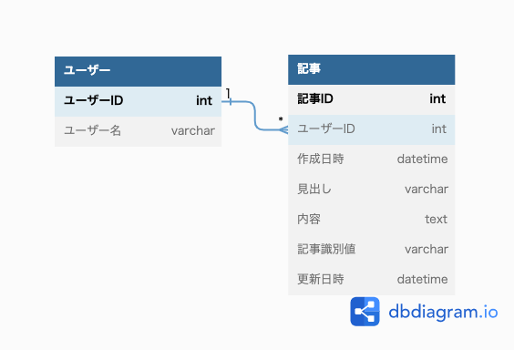

# 課題1

- 更新記事テーブルはインサート処理のみ行う。
- 最新記事テーブルは更新記事テーブルへインサートするたびに更新される。 -> トリガーを利用など
- 更新記事テーブルの識別値はユニーク制約をかける。
- 識別値はバージョン復元時に参照する、オートインクリメントのプライマリーキーだと推測可能のため。

# 課題2

## 課題2-1
- 自分は以前まで分析用途も考慮することがあったが、分析用のエコシステム(BigQueryなど)が発達していることから、分析用途であれば保存しておく必要がないと考える。
  - どういった用途だと履歴を保存するかと考えた時、アプリケーションの振る舞いとして更新によって失ってはないけないデータの場合であると考える。(会員情報の編集履歴など)

## 課題2-2

### 説明
- 同一記事の場合、識別値は同値となる。
- 作成日時は初期インサート時のみ設定

メリット
- テーブル設計としてeasyである。
- 単一テーブルのため、インサートのパフォーマンスは良い。

デメリット
- 最新記事の絞り込みが複雑なクエリになる。
- 更新回数が多くなるとレコード数が膨れ上がる。

