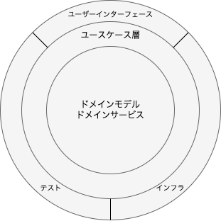

## 課題1-1 解答

中心層がドメイン層に該当する。
ここにはドメイン知識を表現する。この層は独立しているため、他の層への依存を持たない。

中心から次の層がユースケース層に該当する。
ドメイン層が公開している操作を組み合わせてユースケースを実現する。

一番外側の層はプレゼンテーション層に該当する。
ユーザーインターフェースだと、JSONで返したりやHTMLでレンダリングする責務はこの層で実現する

インフラはリポジトリの実装クラス等を実現する。

依存関係は「外側の層から内側の層」に向かう。

## 課題1-2 解答
ドメイン層を独立させることによって、低結合、高凝集のモデルで構築することができるため、保守性が向上する。

## 課題1-3 解答
インターフェースに依存させることによって、各層毎の責務の範囲で実装することができ、実装クラス等に影響せず開発を進めることができる。

## 課題1-4 解答
ドメイン層にはリポジトリのインターフェースを実装し、インフラにはリポジトリの実装クラスをおくことで実装クラスに依存することなく、ドメイン層を表現している。

## 課題1-5 解答

## 課題1-6 解答
プレゼンテーション層

## 課題2 解答
- ORマッパー

