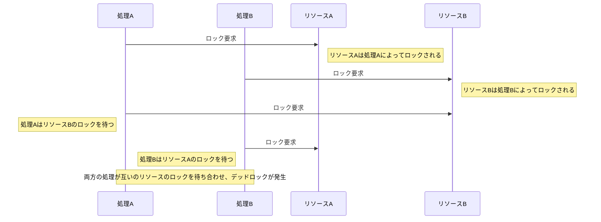

## 課題1

## 1-1
デッドロックとは、複数のトランザクションが互いに他のトランザクションによって保持されているリソース（例えば、データベース内のロックされた行やテーブル）の解放を待ち合わせることで、どのトランザクションも進行できなくなる状態のことである。



## 1-2
正規化に伴う複雑化
当初は、取引情報を管理するテーブルのみが存在し、その際は同一テーブル内のカラムでお届け先情報も管理していた。
しかし、配送連携サービスが増えたことで取引情報を管理するテーブルとお届け先情報を管理するテーブルで分割することになった。

すると、数多くデータベースでエラーが発生するようになった。

複数のレコードをまとめて構造にするメリットとして、不要な部分を保存する必要はない。

```sql
-- 送り先住所を更新
UPDATE ... WHERE transaction_id = xxx AND type = 'src';
-- 発送元住所を更新
UPDATE ... WHERE transaction_id = xxx AND type = 'dst';
-- 拠点受け取りの際の住所を更新
UPDATE ... WHERE transaction_id = xxx AND type = 'cvs';
```

原因はMySQLのギャップロックだと判明。
トランザクション中で存在しない行に対してUPDATEなどを実行すると、インデックスのスキマ全域に対してロックがかかる。

```txt
...
transaction_id = 100
(データにスキマがある)
transaction_id = 110
...
```
この状態でtransaction_id = 105のレコードを想定して何らかの更新を行おうとしたときなどである。
ギャップロックがかけられたスキマは、INSERTがブロックされるようになる。

レコードの実在確認をしてからUPDATEを走らせるように修正したことで、タイムアウトする問題は対応できた。

参考にしたURL
- https://engineering.mercari.com/blog/entry/2017-12-18-deadlock/


## 1-3
READ UNCOMMITED
- 他のトランザクションによって変更されたが、まだコミットされていないデータを読み取ることができる（ダーティリード）。
- 問題点：他のトランザクションがロールバックした場合、無効または誤ったデータを読み取るリスクがある。

READ COMMITED
- コミットされたデータのみを読み取る。これにより、ダーティリードは防げるが、同じトランザクション内で異なる時間に同じデータを読み取ると、異なる結果が得られる可能性がある（ノンリピータブルリード）。
- 問題点：トランザクションが実行されている間に他のトランザクションによってデータが変更される可能性がある。

REPEATABLE READ
- トランザクションが開始されてから終了するまでの間、同じデータに対する一貫性を保証する。ノンリピータブルリードは防ぐことができる。
- 問題点：ファントムリードが発生する可能性がある。これは、トランザクション中に他のトランザクションが新しい行を挿入すると、それらの新しい行が後続のクエリで見える状況である。

SERIALIZABLE
- トランザクションが他のトランザクションの影響を受けることなく、独立して実行されたかのように振る舞う最も厳格な分離レベルである。ファントムリードも含め、すべてのリードアノマリーを防ぐことができる。
- 問題点：このレベルではパフォーマンスに影響を与える可能性があり、デッドロックが発生しやすくなる。

参考にしたURL
- https://techracho.bpsinc.jp/kotetsu75/2018_12_14/66410

## 1-4
行レベルのロック
- トランザクションはデータベース内の特定の行のみをロックする。これにより、他のトランザクションはロックされていない行にアクセスできるため、同時実行性が向上する。
- 異なるトランザクションが同じテーブルの異なる行を処理する場合に有効である。
- 多くの異なる行にアクセスするトランザクションがある場合、多数のロックが必要となり、オーバーヘッドが増加することがある。

テーブルレベルのロック
- トランザクションがアクセスするテーブル全体をロックします。これにより、そのテーブルにアクセスする他のすべてのトランザクションがブロックされる。
- テーブル内の大部分またはすべての行にアクセスするトランザクションに適しており、この場合、ロック管理のオーバーヘッドが減少する。
- 問題点としては、テーブル全体がロックされるため、同時実行性が低下し、他のトランザクションが待たされる可能性がある。

## 1-5
悲観ロック(Pessimistic Locking)
- トランザクションがリソースにアクセスする前に、対象のリソース（テーブルまたは行）にロックをかけることである。これにより、他のトランザクションが同時にそのデータを変更することを防ぐことができる。
- データの競合が頻繁に発生すると予想される場合に使用される。つまり、他のトランザクションによる干渉があると想定して先にロックをかける。
- 問題点としては、ロックによりリソースの利用可能性が低下し、デッドロックのリスクが増加することがある。

楽観ロック(Optimistic Locking)
- レコードにバージョン番号やタイムスタンプなどのメタデータを持たせ、更新時にそのメタデータをチェックすることで、データがトランザクション開始時から変更されていないことを確認する。
- データの競合が比較的少ないと予想される状況で有効である。トランザクションの終了時まで競合がないと楽観的に見込んでおり、競合が発生した場合のみ対処する。
- 問題点としては、競合が発生した際にはトランザクションの再試行やロールバックが必要になることがある。

## 1-6
排他ロック(Exclusive Lock)
- データの変更（更新、削除、挿入など）を行う際に使用される。
- 排他ロックがかかっているデータには、他のどのトランザクションも読み取りも書き込みもできない。
- データを更新できるトランザクションは同時に一つだけであり、他のトランザクションはロックが解除されるまで待たなければならない。

共有ロック(Shared Lock)
- データを読み取る際に使用される。
- 複数のトランザクションが同時に同じデータに共有ロックをかけることができ、これにより同時に読み取りが可能になる。
- 共有ロックがかかっているデータに対しては、排他ロックをかけることができないため、そのデータを変更することはできない。

`select....for update`は、排他ロックである。

## 1-7
fuzzy(non-repeatable) read
- トランザクション処理で、あるトランザクションが同じレコードを何度も繰り返し呼び出す場合に途中で他のトランザクションが内容を更新してしまうこと。

phantom read
- トランザクション処理において、あるトランザクションが呼び出しを複数回行うと、その間に他のトランザクションが追加したデータが増えてしまうこと。

参考にしたURL
- https://techracho.bpsinc.jp/kotetsu75/2018_12_14/66410
