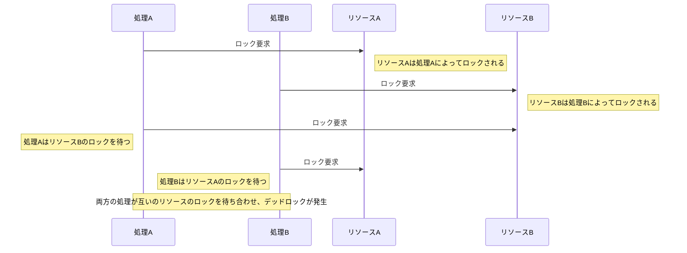

## 課題1

## 1-1
デッドロックとは、複数のトランザクションが互いに他のトランザクションによって保持されているリソース（例えば、データベース内のロックされた行やテーブル）の解放を待ち合わせることで、どのトランザクションも進行できなくなる状態のことである。



## 1-2
### 正規化に伴う複雑化
当初は、取引情報を管理するテーブルのみが存在し、その際は同一テーブル内のカラムでお届け先情報も管理していた。
しかし、配送連携サービスが増えたことで取引情報を管理するテーブルとお届け先情報を管理するテーブルで分割することになった。

すると、数多くデータベースでエラーが発生するようになった。

複数のレコードをまとめて構造にするメリットとして、不要な部分を保存する必要はない。

```sql
-- 送り先住所を更新
UPDATE ... WHERE transaction_id = xxx AND type = 'src';
-- 発送元住所を更新
UPDATE ... WHERE transaction_id = xxx AND type = 'dst';
-- 拠点受け取りの際の住所を更新
UPDATE ... WHERE transaction_id = xxx AND type = 'cvs';
```

原因はMySQLのギャップロックだと判明。
トランザクション中で存在しない行に対してUPDATEなどを実行すると、インデックスのスキマ全域に対してロックがかかる。
存在しないレコードに対してのUPDATE文を安易に発行していたため、、別取引のレコードのINSERTもブロックされており、ロックが過剰になっていたとのこと。

```txt
...
transaction_id = 100
(データにスキマがある)
transaction_id = 110
...
```
この状態でtransaction_id = 105のレコードを想定して何らかの更新を行おうとしたときなどである。
ギャップロックがかけられたスキマは、INSERTがブロックされるようになる。

レコードの実在確認をしてからUPDATEを走らせるように修正したことで、タイムアウトする問題は対応できたとのこと。

参考にしたURL
- https://engineering.mercari.com/blog/entry/2017-12-18-deadlock/

### ギャップロック
ギャップロックとは、行そのものではなく、インデックスの値の間の「ギャップ」に対して適用されるロックである。
ギャップロックは、ファントムリードを防ぐために使用される。

- https://qiita.com/kenjiszk/items/05f7f6e695b93570a9e1#%E3%82%AE%E3%83%A3%E3%83%83%E3%83%97%E3%83%AD%E3%83%83%E3%82%AF

## 1-3
READ UNCOMMITED
- 他のトランザクションによって変更されたが、まだコミットされていないデータを読み取ることができる（ダーティリード）。
- 問題点：他のトランザクションがロールバックした場合、無効または誤ったデータを読み取るリスクがある。

READ COMMITED
- コミットされたデータのみを読み取る。これにより、ダーティリードは防げるが、同じトランザクション内で異なる時間に同じデータを読み取ると、異なる結果が得られる可能性がある（ノンリピータブルリード）。
- 問題点：トランザクションが実行されている間に他のトランザクションによってデータが変更される可能性がある。

REPEATABLE READ
- トランザクションが開始されてから終了するまでの間、同じデータに対する一貫性を保証する。ノンリピータブルリードは防ぐことができる。
- 問題点：ファントムリードが発生する可能性がある。これは、トランザクション中に他のトランザクションが新しい行を挿入すると、それらの新しい行が後続のクエリで見える状況である。

SERIALIZABLE
- トランザクションが他のトランザクションの影響を受けることなく、独立して実行されたかのように振る舞う最も厳格な分離レベルである。ファントムリードも含め、すべてのリードアノマリーを防ぐことができる。
- 問題点：このレベルではパフォーマンスに影響を与える可能性があり、デッドロックが発生しやすくなる。

参考にしたURL
- https://techracho.bpsinc.jp/kotetsu75/2018_12_14/66410

## 1-4
行レベルのロック
- トランザクションはデータベース内の特定の行のみをロックする。これにより、他のトランザクションはロックされていない行にアクセスできるため、同時実行性が向上する。
- 異なるトランザクションが同じテーブルの異なる行を処理する場合に有効である。
- 多くの異なる行にアクセスするトランザクションがある場合、多数のロックが必要となり、オーバーヘッドが増加することがある。

テーブルレベルのロック
- トランザクションがアクセスするテーブル全体をロックします。これにより、そのテーブルにアクセスする他のすべてのトランザクションがブロックされる。
- テーブル内の大部分またはすべての行にアクセスするトランザクションに適しており、この場合、ロック管理のオーバーヘッドが減少する。
- 問題点としては、テーブル全体がロックされるため、同時実行性が低下し、他のトランザクションが待たされる可能性がある。

## 1-5
悲観ロック(Pessimistic Locking)
- トランザクションがリソースにアクセスする前に、対象のリソース（テーブルまたは行）にロックをかけることである。これにより、他のトランザクションが同時にそのデータを変更することを防ぐことができる。
- データの競合が頻繁に発生すると予想される場合に使用される。つまり、他のトランザクションによる干渉があると想定して先にロックをかける。
- 問題点としては、ロックによりリソースの利用可能性が低下し、デッドロックのリスクが増加することがある。

楽観ロック(Optimistic Locking)
- レコードにバージョン番号やタイムスタンプなどのメタデータを持たせ、更新時にそのメタデータをチェックすることで、データがトランザクション開始時から変更されていないことを確認する。
- データの競合が比較的少ないと予想される状況で有効である。トランザクションの終了時まで競合がないと楽観的に見込んでおり、競合が発生した場合のみ対処する。
- 問題点としては、競合が発生した際にはトランザクションの再試行やロールバックが必要になることがある。

## 1-6
排他ロック(Exclusive Lock)
- データの変更（更新、削除、挿入など）を行う際に使用される。
- 排他ロックがかかっているデータには、他のどのトランザクションも読み取りも書き込みもできない。
- データを更新できるトランザクションは同時に一つだけであり、他のトランザクションはロックが解除されるまで待たなければならない。

共有ロック(Shared Lock)
- データを読み取る際に使用される。
- 複数のトランザクションが同時に同じデータに共有ロックをかけることができ、これにより同時に読み取りが可能になる。
- 共有ロックがかかっているデータに対しては、排他ロックをかけることができないため、そのデータを変更することはできない。

`select....for update`は、排他ロックである。

## 1-7
fuzzy(non-repeatable) read
- トランザクション処理で、あるトランザクションが同じレコードを何度も繰り返し呼び出す場合に途中で他のトランザクションが内容を更新してしまうこと。

phantom read
- トランザクション処理において、あるトランザクションが呼び出しを複数回行うと、その間に他のトランザクションが追加したデータが増えてしまうこと。

参考にしたURL
- https://techracho.bpsinc.jp/kotetsu75/2018_12_14/66410

# 課題2
## 課題2-1

### Dirty Read

### 1
```sql
-- トランザクション1
SET SESSION TRANSACTION ISOLATION LEVEL READ UNCOMMITTED;

START TRANSACTION;
UPDATE employees SET first_name='Michael' WHERE emp_no = 10001;

```

```sql
-- トランザクション2
SET SESSION TRANSACTION ISOLATION LEVEL READ UNCOMMITTED;

SELECT * FROM employees WHERE emp_no = 10001;
-- Michael
```

### 2

```sql
-- トランザクション1
ROLLBACK;
```

```sql
-- トランザクション2
SELECT * FROM employees WHERE emp_no = 10001;
-- Georgi
```

### Non-repetable read

### 1
```sql
-- トランザクション1
SET SESSION TRANSACTION ISOLATION LEVEL READ COMMITTED;

START TRANSACTION;

SELECT * FROM employees WHERE emp_no = 10001;
-- Georgi
```

```sql
-- トランザクション2
SET SESSION TRANSACTION ISOLATION LEVEL READ COMMITTED;
START TRANSACTION;

UPDATE employees SET first_name='Mike' WHERE emp_no = 10001;
COMMIT;
```

### 2
```sql
-- トランザクション1
SELECT * FROM employees WHERE emp_no = 10001;
-- Mike
COMMIT;
```

### Phantom read

### 1
```sql
-- トランザクション1
SET SESSION TRANSACTION ISOLATION LEVEL REPEATABLE READ;
START TRANSACTION;

SELECT COUNT(*) FROM employees;
-- 300024
```

```sql
-- トランザクション2
SET SESSION TRANSACTION ISOLATION LEVEL REPEATABLE READ;
START TRANSACTION;

INSERT INTO employees (emp_no,birth_date,first_name,last_name,gender,hire_date) VALUES ('500000', '1972-05-01', 'New', 'User', 'M', '1997-11-30');
COMMIT;
```

### 2
```sql
-- トランザクション1
SELECT COUNT(*) FROM employees;
COMMIT;
-- 300024のまま
```

## 課題2-2
- 余程でない限り多重予約がないとあるので、データの競合が比較的少ないと予想される状況で有効である楽観ロックを採用する。

シート情報を管理するテーブルにバージョンカラムを追加し、更新する前にバージョン比較をすることで、他のトランザクションによってレコードが更新されていないかを行う。

```php
<?php


function updateSeat(Seat $seat) {
    // データベース接続を取得
    $db = getDatabaseConnection();

    // トランザクションを開始
    $db->beginTransaction();

    try {
        // 最新の席情報を取得し、バージョン番号を確認
        $stmt = $db->prepare("SELECT version FROM seats WHERE id = :id");
        $stmt->execute(['id' => $seat->id]);
        $row = $stmt->fetch();

        if ($row && $row['version'] === $seat->version) {
            // バージョンが一致した場合、更新を実行
            $seat->version++; // バージョンをインクリメント
            $updateStmt = $db->prepare("UPDATE seats SET /* その他の更新内容 */, version = :version WHERE id = :id AND version = :original_version");
            $updateStmt->execute(['id' => $seat->id, 'version' => $seat->version, 'original_version' => $seat->version - 1]);

            // トランザクションをコミット
            $db->commit();
        } else {
            // バージョンが一致しない場合、競合が発生している
            $db->rollBack();
            throw new Exception("競合が発生しました。更新できません。");
        }
    } catch (Exception $e) {
        // エラーが発生した場合、トランザクションをロールバック
        $db->rollBack();
        throw $e;
    }
}
```

## food for thought
自分達が管理しているDBへの永続化から先に行うのが良いと考える。
理由としては、自社のデータベースには完全な制御権があり、トランザクションをより細かく制御できる。これにより、問題が発生した場合のロールバックが容易になる。また、外部APIへのリクエストは、ネットワークの問題やサードパーティのサービスの可用性の問題など、不確実性を含むことが多い。内部的なプロセスを完了してから外部APIを呼び出すことで、これらの不確実性に対処しやすくなるためである。

## 課題2-3
### 1
トランザクションが開始された際に、対象のテーブルにロックをかけ、、他のトランザクションがそのテーブルにアクセスするのを防ぐ。ただし、そのテーブルに対する他のすべての操作がブロックされ、システムのスループットが大幅に低下する可能性がある。

### 2
Parentに該当するレコードに対して、行レベルのロックをかけChildの数をチェックしてから新しいChildを挿入する。

```sql
-- トランザクション開始
START TRANSACTION;

-- 対象のparentレコードに行レベルのロックを取得
SELECT * FROM parents WHERE parent_id = 1 FOR UPDATE;

-- childレコードの数を確認
SELECT COUNT(*) FROM children WHERE parent_id = 1;

-- ここでプログラム側で子レコードの数が5未満であることを確認

-- 新しいchildを挿入（子レコードの数が5未満の場合）
INSERT INTO children (child_id, parent_id, name) VALUES (新しいchild_id, 1, '新しいchildの名前');

-- トランザクションをコミット
COMMIT;
```


## 課題3
MySQLにおいて、トランザクション内で新しいトランザクションを開始しようとする場合どうなるか。

```sql
START TRANSACTION;
UPDATE employees SET first_name='TEST1' WHERE emp_no = 10001;
START TRANSACTION;
UPDATE employees SET first_name='TEST2' WHERE emp_no = 10001;
COMMIT;
```

<details>
<summary>解答</summary>
START TRANSACTION;
<br>
UPDATE employees SET first_name='TEST1' WHERE emp_no = 10001;
<br>
START TRANSACTION; // この時点でTEST1になる
<br>
UPDATE employees SET first_name='TEST2' WHERE emp_no = 10001;
<br>
COMMIT; // この時点でTEST2になる
</details>
